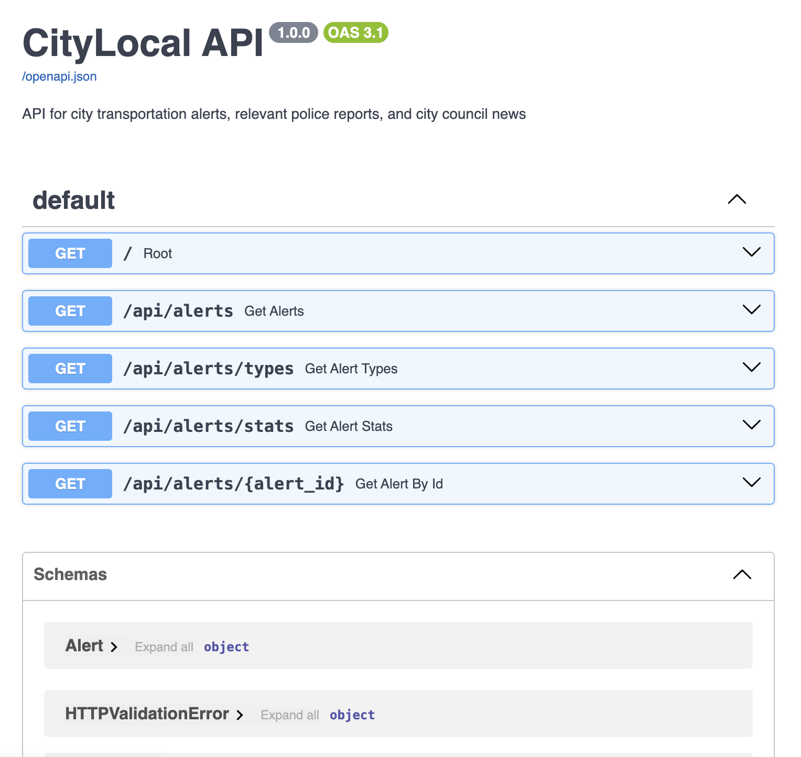
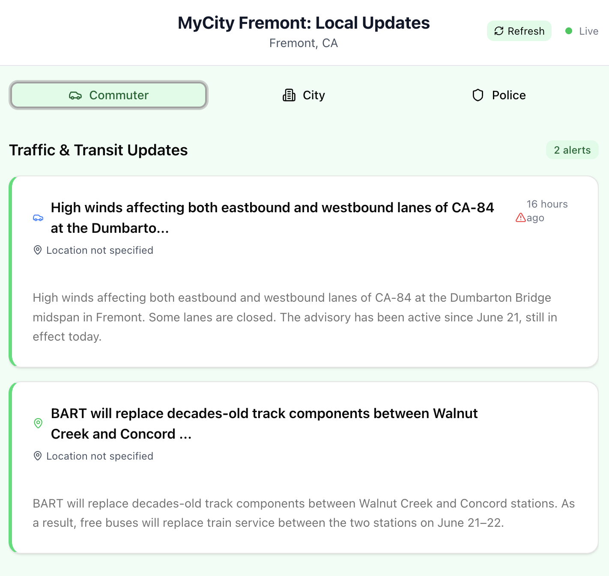

## Inspiration
Local news deserts have been expanding rapidly across the U.S., with 3,300 newspapers closing over the past two decades. While short videos on emerging platforms offer quick updates, the MyCity portal serves as a reliable and accurate source of truth, helping people stay informed about what’s happening in their own cities.

## What it does
MyCity is a web app—soon to be primarily mobile—that crawls selected official information sources at carefully chosen intervals to deliver timely updates. Drawing on the expertise of seasoned journalists to identify authoritative sources, the app uses one-shot and few-shot prompt engineering to guide its professional writing. The result is relevant, bite-sized, and unbiased information briefs—free of fluff.

## How we built it
The stack includes Python, Claude API, SQLite, FastAPI, React, and Vercel.

## Challenges we ran into
The two secret ingredients of this project—gathering meaningful information based on lived human experience and producing strong content—also posed the biggest challenges. Properly guiding LLMs in professional news writing requires extra onboarding time. For instance, when condensing lengthy documents such as city council meeting minutes, considerable effort went into prompting the Claude API to generate high-quality summaries. Well-crafted few-shot prompts were essential in these cases.

## Accomplishments that we're proud of
The current prototype includes content relevant to commuters, such as traffic updates and major public transportation alerts. In the Fremont city prototype, the current workflow can handle the daily output of two full-time journalists already. In a newsroom setting, this tool would allow professional journalists to focus on more creative and investigative tasks.

## What's next for MyCity
We plan to expand the Fremont MyCity prototype with additional local sources and features. Another section of the app will allow users to receive updates from various local event calendars. Users can like or skip events to build a personalized MyCity event calendar.  In the next phase, we will also develop a mobile-first version of the app.

## Steps finished so far by the end of the hackathon period
* Web crawling workflow set up
* Database created
* Working API connected to the database:

* Set up tutored writing via Claude API

Example text:
> The Fremont City Council approved several major infrastructure and service spending items totaling over $9 million at their May 20 regular meeting. All items on the agenda passed unanimously during the meeting.

> Key Items Approved:

> • **Road Repairs:** $4.986 million contract for the 2025 Cape and Slurry Seal Project to maintain city streets  
> • **Parkland Purchase:** $800,000 to buy property at Fremont Boulevard & St. Leonards Way for parks  
> • **Street Maintenance:** $1.03 million annually for 7-year landscape maintenance contract for city streetscapes  
> • **Equipment Purchases:** $836,000 for two new street sweepers; $245,000 for Wi-Fi upgrades at city facilities  
> • **Fuel Costs:** $1.463 million annual contract for gasoline and diesel fuel for city vehicles  
> • **Transportation Services:** $510,000 annually for Lyft ride-hailing services and $120,000 for call center services for seniors and disabled residents through 2028  

Mock main page:

